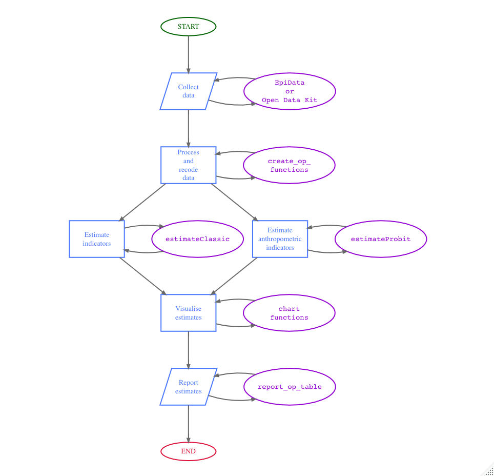

<!-- README.md is generated from README.Rmd. Please edit that file -->

```{r, echo = FALSE}
knitr::opts_chunk$set(
  error = FALSE,
  warning = FALSE,
  message = FALSE,
  collapse = TRUE,
  comment = "#>",
  fig.path = "man/figures/README-"
)
```

# oldr: An Implementation of the Rapid Assessment Method for Older People (RAM-OP) 

<!-- badges: start -->
[](https://www.repostatus.org/#active)
[](https://lifecycle.r-lib.org/articles/stages.html#stable)
[](https://github.com/rapidsurveys/oldr/actions/workflows/R-CMD-check.yaml)
[](https://github.com/rapidsurveys/oldr/actions/workflows/rhub.yaml)
[](https://github.com/rapidsurveys/oldr/actions/workflows/test-coverage.yaml)
[](https://app.codecov.io/gh/rapidsurveys/oldr)
[](https://www.codefactor.io/repository/github/rapidsurveys/oldr)
[](https://zenodo.org/badge/latestdoi/105472081)
<!-- badges: end -->

[HelpAge International](https://www.helpage.org), [VALID International](http://www.validinternational.org), and [Brixton Health](http://www.brixtonhealth.com), with financial assistance from the [Humanitarian Innovation Fund (HIF)](http://www.elrha.org/hif/home/), have developed a **Rapid Assessment Method for Older People (RAM-OP)** that provides accurate and reliable estimates of the needs of older people. The method uses simple procedures, in a short time frame (i.e. about two weeks including training, data collection, data entry, and data analysis), and at considerably lower cost than other methods. The **RAM-OP** method is based on the following principles:

* Use of a familiar *“household survey”* design employing a two-stage cluster sample design optimised to allow the use of a small primary sample (*m ≥ 16 clusters*) and a small overall (*n ≥ 192*) sample.

* Assessment of multiple dimensions of need in older people (including prevalence of global, moderate and severe acute malnutrition) using, whenever possible, standard and well-tested indicators and question sets.

* Data analysis performed using modern computer-intensive methods to allow estimates of indicator levels to be made with useful precision using a small sample size.

## Installation

You can install `oldr` from [CRAN](https://cran.r-project.org) with:

```{r install-cran, echo = TRUE, eval = FALSE}
install.packages("oldr")
```

You can install the development version of `oldr` from [GitHub](https://github.com/rapidsurveys/oldr) with:

```{r install, eval = FALSE}
if(!require(remotes)) install.packages("remotes")
remotes::install_github("rapidsurveys/oldr")
```

## Usage

This package contains functions that support in the data processing, analysis and visualisation of RAM-OP survey datasets collected using the standard RAM-OP survey questionnaire.

The figure below illustrates the RAM-OP workflow and indicates which functions in the `oldr` package support which particular step in the process.

```{r ramOPworkflow, echo = FALSE, eval = FALSE, fig.width = 8, fig.height = 10, fig.align = "center"}
DiagrammeR::grViz("
  digraph ramOP {

    # a 'graph' statement
    graph [overlap = false, fontsize = 14, fontname = Helvetica]

    # Terminal nodes
    node [shape = oval, width = 1.5, penwidth = 2, fontsize = 14]
        
    a [label = '@@1'; color = darkgreen; fontcolor = darkgreen];
    n [label = '@@14'; color = crimson; fontcolor = crimson];

    # Input/output nodes
    node [shape = parallelogram, fixedsize = true, height = 1, width = 1.5, 
          penwidth = 2, color = royalblue1, fontcolor = royalblue1]
    
    b [label = '@@2'];
    l [label = '@@12']

    # Process nodes
    node [shape = rect]
  
    d [label = '@@4'];
    g [label = '@@7'];
    h [label = '@@8'];
    j [label = '@@10'];

    # Package nodes
    node [shape = oval, fixedsize = TRUE, width = 2.5, penwidth = 2, 
          fontsize = 14, fontname = Courier, color = darkviolet, 
          fontcolor = darkviolet]
    
    c [label = '@@3';];
    e [label = '@@5';];
    f [label = '@@6'];
    i [label = '@@9'];
    k [label = '@@11'];
    m [label = '@@13'];

    edge [minlen = 2, arrowsize = 0.75, penwidth = 2, color = dimgray]
    
    a -> b
    b -> d
    d -> g
    d -> h
    g -> j
    h -> j
    j -> l
    l -> n

    edge [minlen = 3]

    b -> c
    c -> b
    d -> e
    e -> d
    f -> g
    g -> f
    h -> i
    i -> h
    j -> k
    k -> j
    l -> m
    m -> l

    subgraph {
      rank = same; b; c;
    }

    subgraph {
      rank = same; d; e;
    }

    subgraph {
      rank = same; f; g; h; i;
    }
    
    subgraph {
      rank = same; j; k
    }
    
    subgraph {
      rank = same; l; m;
    }

  }

    [1]: 'START'
    [2]: 'Collect\\ndata'
    [3]: 'EpiData\\nor\\nOpen Data Kit'
    [4]: 'Process\\nand\\nrecode\\ndata'
    [5]: 'create_op_\\nfunctions'
    [6]: 'estimate_classic'
    [7]: 'Estimate\\nindicators'
    [8]: 'Estimate\\nanthropometric\\nindicators'
    [9]: 'estimate_probit'
    [10]: 'Visualise\\nestimates'
    [11]: 'chart_\\nfunctions'
    [12]: 'Report\\nestimates'
    [13]: 'report_op_\\nfunctions'
    [14]: 'END'
"
)
```

```{r workflow, echo = FALSE, eval = TRUE, fig.align = "center", out.width = "80%"}

```

For a more detailed description of the RAM-OP survey, read the [RAM-OP manual](https://rapidsurveys.io/ramOPmanual/).

## Citation

If you find the `oldr` package useful, please cite using the suggested citation provided by a call to the `citation` function as follows:

```{r cite}
citation("oldr")
```

## Community guidelines

Feedback, bug reports, and feature requests are welcome; file issues or seek support [here](https://github.com/rapidsurveys/oldr/issues). If you would like to contribute to the package, please see our [contributing guidelines](https://rapidsurveys.io/oldr/CONTRIBUTING.html).

This project is released with a [Contributor Code of Conduct](https://rapidsurveys.io/oldr/CODE_OF_CONDUCT.html). By contributing to this project, you agree to abide by its terms.
