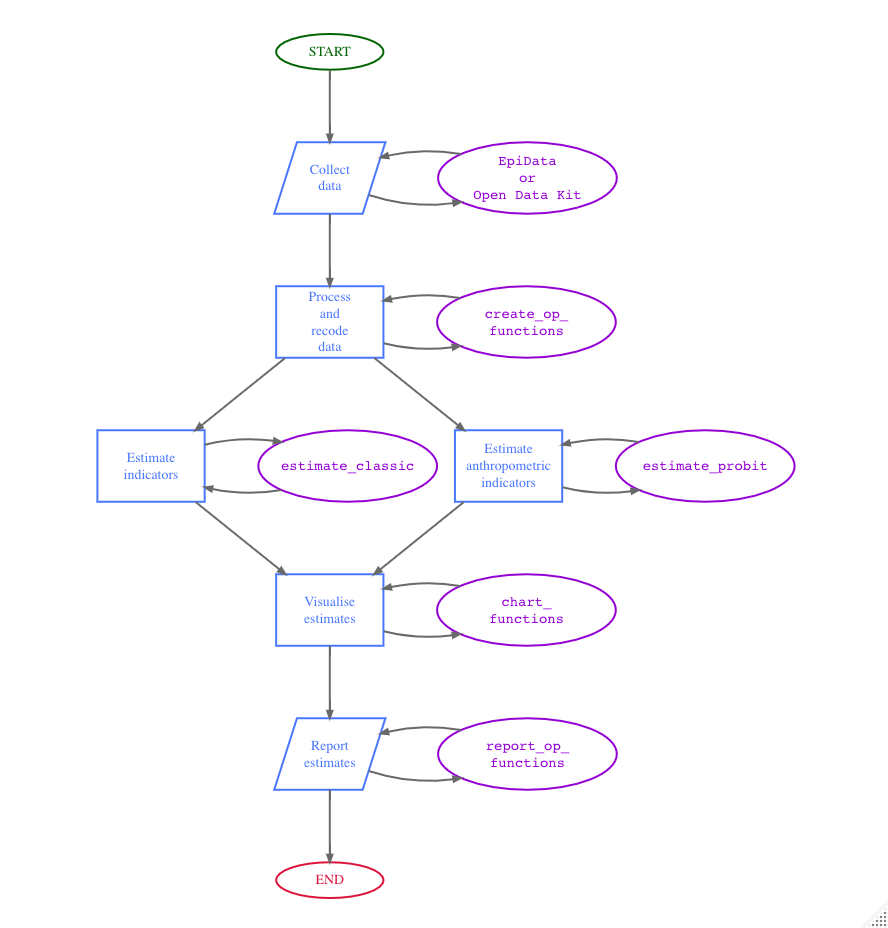
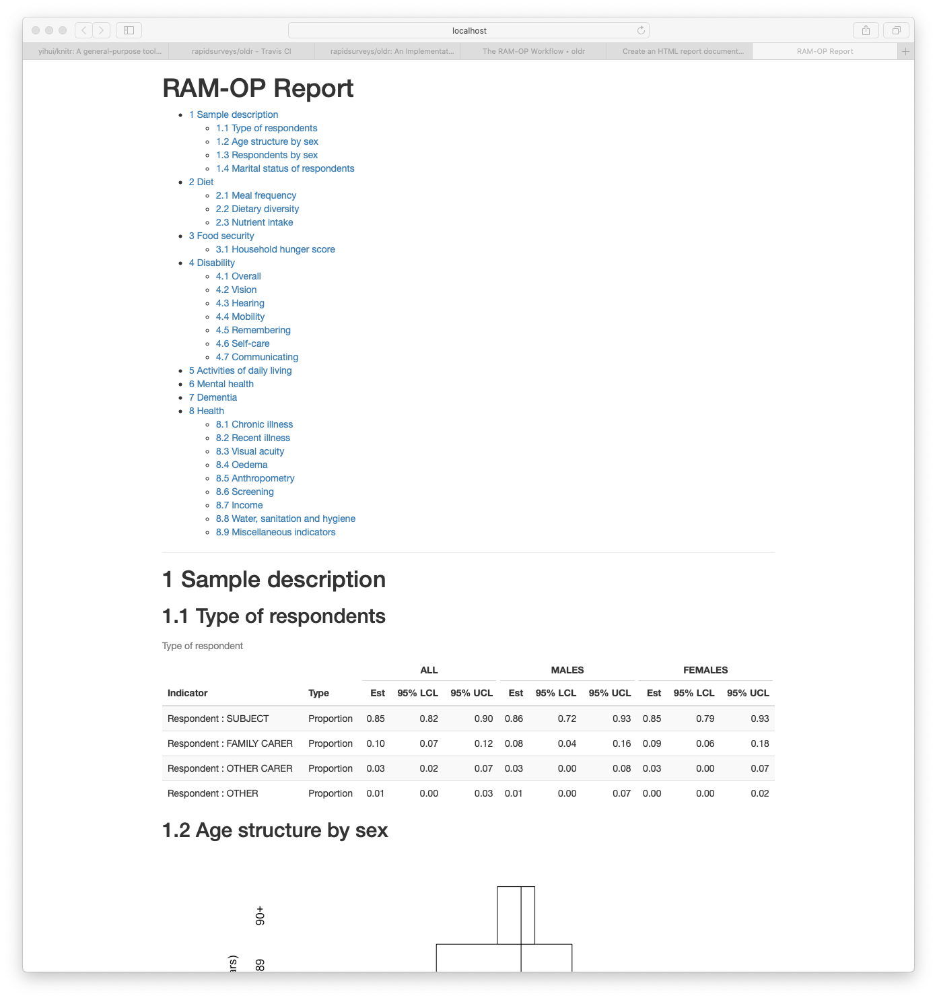

```{r, include = FALSE}
knitr::opts_chunk$set(
  message = FALSE,
  warning = FALSE,
  error = FALSE,
  collapse = TRUE,
  comment = "#>"
)
```

```{r setup, echo = FALSE, eval = TRUE}
library(oldr)
library(DiagrammeR)
```

The RAM-OP Workflow is summarised in the diagram below.

```{r ramOPworkflow, echo = FALSE, eval = FALSE, fig.width = 8, fig.height = 10, fig.align = "center"}
DiagrammeR::grViz("
  digraph ramOP {

    # a 'graph' statement
    graph [overlap = false, fontsize = 14, fontname = Helvetica]

    # Terminal nodes
    node [shape = oval, width = 1.5, penwidth = 2, fontsize = 14]
        
    a [label = '@@1'; color = darkgreen; fontcolor = darkgreen];
    n [label = '@@14'; color = crimson; fontcolor = crimson];

    # Input/output nodes
    node [shape = parallelogram, fixedsize = true, height = 1, width = 1.5, 
          penwidth = 2, color = royalblue1, fontcolor = royalblue1]
    
    b [label = '@@2'];
    l [label = '@@12']

    # Process nodes
    node [shape = rect]
  
    d [label = '@@4'];
    g [label = '@@7'];
    h [label = '@@8'];
    j [label = '@@10'];

    # Package nodes
    node [shape = oval, fixedsize = TRUE, width = 2.5, penwidth = 2, 
          fontsize = 14, fontname = Courier, color = darkviolet, 
          fontcolor = darkviolet]
    
    c [label = '@@3';];
    e [label = '@@5';];
    f [label = '@@6'];
    i [label = '@@9'];
    k [label = '@@11'];
    m [label = '@@13'];

    edge [minlen = 2, arrowsize = 0.75, penwidth = 2, color = dimgray]
    
    a -> b
    b -> d
    d -> g
    d -> h
    g -> j
    h -> j
    j -> l
    l -> n

    edge [minlen = 3]

    b -> c
    c -> b
    d -> e
    e -> d
    f -> g
    g -> f
    h -> i
    i -> h
    j -> k
    k -> j
    l -> m
    m -> l

    subgraph {
      rank = same; b; c;
    }

    subgraph {
      rank = same; d; e;
    }

    subgraph {
      rank = same; f; g; h; i;
    }
    
    subgraph {
      rank = same; j; k
    }
    
    subgraph {
      rank = same; l; m;
    }

  }

    [1]: 'START'
    [2]: 'Collect\\ndata'
    [3]: 'EpiData\\nor\\nOpen Data Kit'
    [4]: 'Process\\nand\\nrecode\\ndata'
    [5]: 'create_op_\\nfunctions'
    [6]: 'estimateClassic'
    [7]: 'Estimate\\nindicators'
    [8]: 'Estimate\\nanthropometric\\nindicators'
    [9]: 'estimateProbit'
    [10]: 'Visualise\\nestimates'
    [11]: 'chart\\nfunctions'
    [12]: 'Report\\nestimates'
    [13]: 'report_op_table'
    [14]: 'END'
"
)
```

```{r workflow, echo = FALSE, eval = TRUE, fig.alt = "RAM-OP workflow", out.width = "80%"}

```

The `oldr` package provides functions to use for all steps after data collection. These functions were developed specifically for the data structure created by the [EpiData](https://www.dropbox.com/s/2kudlxjqcqn8wph/RAMOP%20data%20entry%20files%20%28English%29.zip?dl=0) or the [Open Data Kit](https://ona.io/helpage/75817/368135/form.xls) collection tools. The data structure produced by these collection tools is shown by the dataset `testSVY` included in the `oldr` package.

```{r data, echo = TRUE, eval = TRUE}
testSVY
```

## Processing and recoding data

Once RAM-OP data is collected, it will need to be processed and recoded based on the definitions of the various indicators included in RAM-OP. The `oldr` package provides a suite functions to perform this processing and recoding. These functions and their syntax can be easily remembered as the `create_op_` functions as their function names start with the `create_` verb followed by the `op_` label and then followed by an indicator or indicator set specific identifier or short name. Finally, an additional tag for `male` or `female` can be added to the main function to provide gender-specific outputs. 

Currently, a standard RAM-OP can provide results for the 13 indicators or indicator sets for older people. The following table shows these indicators/indicator sets alongside the functions related to them:

**Indicator / Indicator Set** | **Related Functions**
:--- | :---
Demography and situation | `create_op_demo`; `create_op_demo_males`; `create_op_demo_females`
Food intake | `create_op_food`; `create_op_food_males`; `create_op_food_females`
Severe food insecurity | `create_op_hunger`; `create_op_hunger_males`; `create_op_hunger_females`
Disability | `create_op_disability`; `create_op_disability_males`; `create_op_disability_females`
Activities of daily living | `create_op_adl`; `create_op_adl_males`; `create_op_adl_females`
Mental health and well-being | `create_op_mental`; `create_op_mental_males`; `create_op_mental_females`
Dementia | `create_op_dementia`; `create_op_dementia_males`; `create_op_dementia_females`
Health and health-seeking behaviour | `create_op_health`; `create_op_health_males`; `create_op_health_females`
Sources of income | `create_op_income`; `create_op_income_males`; `create_op_income_females`
Water, sanitation, and hygiene | `create_op_wash`; `create_op_wash_males`; `create_op_wash_females`
Anthropometry and anthropometric screening coverage | `create_op_anthro`; `create_op_anthro_males`; `create_op_anthro_females`
Visual impairment | `create_op_visual`; `create_op_visual_males`; `create_op_visual_females`
Miscellaneous | `create_op_misc`; `create_op_misc_males`; `create_op_misc_females`

A final function in the processing and recoding set -  `create_op` - is provided to perform the processing and recoding of all indicators or indicator sets. This function allows for the specification of which indicators or indicator sets to process and recode which is useful for cases where not all the indicators or indicator sets have been collected or if only specific indicators or indicator sets need to be analysed or reported. This function also specifies whether a specific gender subset of the data is needed.

For a standard RAM-OP implementation, this step is performed in R as follows:

```{r step1, echo = TRUE, eval = FALSE}
## Process and recode all standard RAM-OP indicators in the testSVY dataset
create_op(svy = testSVY)
```

which results in the following output:

```{r step1a, echo = FALSE, eval = TRUE}
## Process and recode all standard RAM-OP indicators in the testSVY dataset
create_op(svy = testSVY)
```

## Estimating indicators

Once data has been processed and appropriate recoding for indicators has been performed, indicator estimates can now be calculated.

It is important to note that estimation procedures need to account for the sample design. All major statistical analysis software can do this (details vary). There are two things to note:

* The RAM-OP sample is a two-stage sample. Subjects are sampled from a small number of primary sampling units (PSUs).

* The RAM-OP sample is not prior weighted. This means that per-PSU sampling weights are needed. These are usually the populations of the PSU.

This sample design will need to be specified to statistical analysis software being used. If no weights are provided, then the analysis may produce estimates that place undue weight to observations from smaller communities with confidence intervals with lower than nominal coverage (i.e. they will be too narrow).

### Blocked weighted bootstrap

The `oldr` package uses **blocked weighted bootstrap** estimation approach:

* **Blocked** : The block corresponds to the PSU or cluster.

* **Weighted** : The RAM-OP sampling procedure does not use population proportional sampling to weight the sample prior to data collection as is done with SMART type surveys. This means that a posterior weighting procedure is required. The standard RAM-OP software uses a “roulette wheel” algorithm to weight (i.e. by population) the selection probability of PSUs in bootstrap replicates.

A total of `m` PSUs are sampled with-replacement from the survey dataset where `m` is the number of PSUs in the survey sample. Individual records within each PSU are then sampled with-replacement. A total of `n` records are sampled with-replacement from each of the selected PSUs where `n` is the number of individual records in a selected PSU. The resulting collection of records replicates the original survey in terms of both sample design and sample size. A large number of replicate surveys are taken (the standard RAM-OP software uses $r = 399$ replicate surveys but this can be changed). The required statistic (e.g. the mean of an indicator value) is applied to each replicate survey. The reported estimate consists of the 50th (point estimate), 2.5th (lower 95% confidence limit), and the 97.5th (upper 95% confidence limit) percentiles of the distribution of the statistic observed across all replicate surveys. The blocked weighted bootstrap procedure is outlined in the figure below.

```{r bbw, echo = FALSE, eval = TRUE, fig.alt = "Blocked weighted bootstrap", fig.align = "center", out.width = "85%"}
knitr::include_graphics(path = "https://rapidsurveys.io/ramOPmanual/figures/bbw.png")
```

The principal advantages of using a bootstrap estimator are:

* Bootstrap estimators work well with small sample sizes.

* The method is non-parametric and uses empirical rather than theoretical distributions. There are no assumptions of things like normality to worry about.

* The method allows estimation of the sampling distribution of almost any statistic using only simple computational methods.

### PROBIT estimator

The prevalence of GAM, MAM, and SAM are estimated using a **PROBIT estimator**. This type of estimator provides better precision than a classic estimator at small sample sizes as discussed in the following literature:

> World Health Organisation, Physical Status: The use and interpretation of anthropometry. Report of a WHO expert committee, WHO Technical Report Series 854, WHO, Geneva, 1995

> Dale NM, Myatt M, Prudhon C, Briend, A, “Assessment of the PROBIT approach for estimating the prevalence of global, moderate and severe acute malnutrition from population surveys”, Public Health Nutrition, 1–6. https://doi.org/10.1017/s1368980012003345, 2012

> Blanton CJ, Bilukha, OO, “The PROBIT approach in estimating the prevalence of wasting: revisiting bias and precision”, Emerging Themes in Epidemiology, 10(1), 2013, p. 8

An estimate of GAM prevalence can be made using a classic estimator:

$$ \text{prevalence} ~ = ~ \frac{\text{Number of respondents with MUAC < 210}}{\text{Total number of respondents}} $$

On the other hand, the estimate of GAM prevalence made from the RAM-OP survey data is made using a **PROBIT estimator**. The PROBIT function is also known as the *inverse cumulative distribution* function. This function converts parameters of the distribution of an indicator (e.g. the mean and standard deviation of a normally distributed variable) into cumulative percentiles. This means that it is possible to use the normal PROBIT function with estimates of the mean and standard deviation of indicator values in a survey sample to predict (or estimate) the proportion of the population falling below a given threshold. For example, for data with a mean MUAC of 256 mm and a standard deviation of 28 mm the output of the normal PROBIT function for a threshold of 210 mm is 0.0502 meaning that 5.02% of the population are predicted (or estimated) to fall below the 210 mm threshold.

Both the classic and the PROBIT methods can be thought of as estimating area:

```{r probit, echo = FALSE, eval = TRUE, fig.alt = "RAM-OP estimators", out.width = "100%", fig.align = "center"}
knitr::include_graphics(path = "https://rapidsurveys.io/ramOPmanual/figures/indicators26.png")
```

The principal advantage of the PROBIT approach is that the required sample size is usually smaller than that required to estimate prevalence with a given precision using the classic method.

The PROBIT method assumes that MUAC is a normally distributed variable. If this is not the case then the distribution of MUAC is transformed towards normality.

The prevalence of SAM is estimated in a similar way to GAM. The prevalence of MAM is estimated as the difference between the GAM and SAM prevalence estimates:

$$ \widehat{\text{GAM prevalence}} ~ = ~ \widehat{\text{GAM prevalence}} - \widehat{\text{SAM prevalence}} $$

### Classic estimator

The function `estimateClassic` in `oldr` implements the blocked weighted bootstrap classic estimator of RAM-OP. This function uses the `bootClassic` statistic to estimate indicator values.

The `estimateClassic` function is used for all the standard RAM-OP indicators except for anthropometry. The function is used as follows:

```{r classicEstimator, echo = TRUE, eval = FALSE}
## Process and recode RAM-OP data (testSVY)
df <- create_op(svy = testSVY)

## Perform classic estimation on recoded data using appropriate weights provided by testPSU
classicDF <- estimate_classic(x = df, w = testPSU)
```

This results in (using limited replicates to reduce computing time):

```{r classicEstimatorX, echo = FALSE, eval = TRUE}
## Process and recode RAM-OP data (testSVY)
df <- create_op(svy = testSVY)

## Perform classic estimation on recoded data using appropriate weights provided by testPSU
classicDF <- estimate_classic(x = df, w = testPSU, replicates = 9)

## Return results
classicDF
```

## PROBIT estimator

The function `estimateProbit` in `oldr` implements the blocked weighted bootstrap PROBIT estimator of RAM-OP. This function uses the `probit_GAM` and the `probit_SAM` statistic to estimate indicator values.

The `estimateProbit` function is used for only the anthropometric indicators. The function is used as follows:

```{r probitEstimator, echo = TRUE, eval = FALSE}
## Process and recode RAM-OP data (testSVY)
df <- create_op(svy = testSVY)

## Perform probit estimation on recoded data using appropriate weights provided by testPSU
probitDF <- estimate_probit(x = df, w = testPSU)
```

This results in (using limited replicates to reduce computing time):

```{r probitEstimatorX, echo = FALSE, eval = TRUE}
## Process and recode RAM-OP data (testSVY)
df <- create_op(svy = testSVY)

## Perform classic estimation on recoded data using appropriate weights provided by testPSU
probitDF <- estimate_probit(x = df, w = testPSU, replicates = 9)

## Return results
probitDF
```

The two sets of estimates are then merged using the `mergeEstimates` function as follows:

```{r mergeResults, echo = TRUE, eval = FALSE}
## Merge classicDF and probitDF
resultsDF <- merge_estimates(x = classicDF, y = probitDF)

resultsDF
```

which results in:

```{r mergeResultsX, echo = FALSE, eval = TRUE}
## Merge classicDF and probitDF
resultsDF <- merge_estimates(x = classicDF, y = probitDF)

resultsDF
```

## Creating charts

Once indicators has been estimated, the outputs can then be used to create relevant charts to visualise the results. A set of functions that start with the verb `chart_op_` is provided followed by the indicator identifier to specify the type of indicator to visualise. The output of the function is a PNG file saved in the specified filename appended to the indicator identifier within the current working directory or saved in the specified filename appended to the indicator identifier in the specified directory path.

The following shows how to produce the chart for ADLs saved with filename **test** appended at the start inside a temporary directory:

```{r chartADL, echo = TRUE, eval = TRUE}
chart_op_adl(x = create_op(testSVY), filename = file.path(tempdir(), "test"))
```

The resulting PNG file can be found in the temporary directory

```{r checkChart, echo = TRUE, eval = TRUE}
file.exists(path = file.path(tempdir(), "test.png"))
```

and will look something like this:

```{r showChart, echo = FALSE, eval = TRUE, fig.alt = "RAM-OP chart showing information on activities of daily living", out.width = "85%", fig.align = "center"}
#knitr::include_graphics(path = "man/figures/test.ADL.png")
chart_op_adl(x = create_op(testSVY), save_chart = FALSE)
```

## Reporting estimates

Finally, estimates can be reported through report tables. The `report_op_table` function facilitates this through the following syntax:

```{r report, echo = TRUE, eval = TRUE}
report_op_table(estimates = resultsDF, filename = file.path(tempdir(), "TEST"))
```

The resulting CSV file is found in the temporary directory

```{r checkTable, echo = TRUE, eval = TRUE}
file.exists(path = file.path(tempdir(), "TEST.csv"))
```

and will look something like this:

```{r showTable, echo = FALSE, eval = TRUE}
read.csv(
  file = paste(tempdir(), "TEST.report.csv", sep = "/"),
  stringsAsFactors = FALSE
)
```

## The RAM-OP workflow in R using pipe operators

The `oldr` package functions were designed in such a way that they can be piped to each other to provide the desired output. Below we use the base R pipe operator `|>`.

### Piped operation to get output estimates table

```{r estimatePipe1, echo = TRUE, eval = TRUE}
testSVY |>
  create_op() |>
  estimate_op_all(w = testPSU, replicates = 9) |>
  report_op_table(filename = file.path(tempdir(), "TEST"))
```

This results in a CSV file `TEST.report.csv` in the temporary directory

```{r estimatePipe2, echo = TRUE, eval = TRUE}
file.exists(file.path(tempdir(), "TEST.report.csv"))
```

with the following structure:

```{r estimatePipe3, echo = FALSE, eval = TRUE}
read.csv(
  file = paste(tempdir(), "TEST.report.csv", sep = "/"), 
  stringsAsFactors = FALSE
)
```

### Piped operation to get output an HTML report

If the preferred output is a report with combined charts and tables of results, the following piped operations can be performed:

```{r estimateReport1, echo = TRUE, eval = FALSE}
testSVY |>
  create_op() |>
  estimate_op_all(w = testPSU, replicates = 9) |>
  report_op_html(
    svy = testSVY, filename = file.path(tempdir(), "ramOPreport")
  )
```

which results in an HTML file saved in the specified output directory that looks something like this:

```{r estimateReport2, echo = FALSE, eval = TRUE, fig.alt = "Example of a RAM-OP HTML report"}

```
